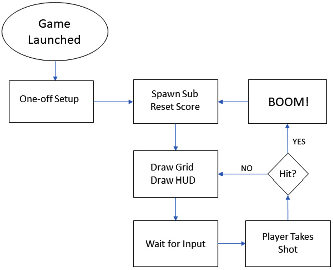

# Learning Java By Building Android Games (Third Edition) – Sub Hunter

## Table of contents

- [Overview](#overview)
  - [The challenge](#the-challenge)
  - [Screenshot](#screenshot)
  - [Links](#links)
- [My process](#my-process)
  - [Progress log](#progress-log)
  - [Built with](#built-with)
  - [What I learned](#what-i-learned)
  - [Continued development](#continued-development)
  - [Useful resources](#useful-resources)
- [Author](#author)
- [Acknowledgments](#acknowledgments)

## Overview
The objective of this game is to find and destroy the enemy sub' in as few moves as possible. The player takes the shot and each time guesses the location of the sub' by taking into account the distance feedback (or sonar ping) from all of the previous shots. 

The game starts with the player facing an empty grid with a randomly placed (hidden) submarine lurking somewhere within it.                

The gird represents the sea, and each place on the gird is a possible hiding place for the submarine that the player is hunting. The player takes shots at the sub' by guessing where it might be hiding and tapping one of the squares on the grid.                                             
                                                                            
As the player takes more shots, they can build up a better mental picture of the likely location of the sub until, eventually, they guess the exact square and the game is won.                                                 
                                                                            
Once the player has destroyed the sub', the next tap on the screen will spawn a new sub' in a random location and the game starts again.            
                                                                            
In addition to the game itself, the game will display debugging information in order to perform tests and check whether everything is working as it should be.                                                                                                                                             

### The challenge

Users should be:

- Able to click on any one of the grids within the screen
- Able to utilize the full screen of the application on their respective android device
- Given hints as to where the submarine is located.
- Able to win the game once the character manages to find the correct location of the hidden sub'.

### Screenshot!

### Links

- Solution URL: [Add solution URL here](https://your-solution-url.com)
- Live Site URL: [Add live site URL here](https://your-live-site-url.com)

## My process
Utilize the android api to create a blank screen. This will allow me to create a grid display.

As the flowchart shows:

1. The game is launched by tapping on its icon in the app drawer (or by running it through Android Studio)
2. The sub' is placed in a random location by generating random horizontal and vertical numbers. The score is set to zero if this is not the first play of the game.
3. Next, everything is drawn to the screen: The gird-lines and text (heads-up display or HUD), including the debugging text (if enabled).
4. At this point, the game does nothing. It is waiting for the player to tap on the screen.
5. When the player taps on the screen, the pixel has been tapped is converted into a location on a grid, and that location is compared to the location of the sub'. The <b>hit?</b> diamond illustrates this comparison. Here, the program could branch back to the drawing phase to redraw everything, including the grid location.
6. Alternatively, if there was a hit, then the <b>BOOM!</b> screen is shown.
7. In fact, the <b>BOOM!</b> part isn't exactly as we see it there. <b>Wait for input</b> phase also handles waiting for a screen tap at this point. When the screen is tapped again, it is considered the first shot of the next game; the flow of the code moves back to the <b>Spawn Reset Score</b> code, and the whole process starts again. This will become clearer as the project progresses.

### Progress Log

#### 03/22/23; 3:34am
Created the first half of the main main layout. Using Android API, all it is right now is a blank screen, which is a start. The next step is to create the grids, followed along with the score/hint board that updates the user with every tap/touch, giving hints as to where the hidden sub' is.

#### 03/25/23; 10:21pm
Slowly connecting the pieces together. The app utilizes the `onCreate()` method to call on both the `newGame()` and `draw()` method to initiate the <b>Wait for Input</b> phase. Once the user taps the screen, the `onTouchEvent()` method will be realized calling the `takeShot()` method. If the user managed to land a hit and sink an enemy sub, the game is reset using the `draw()` method called by `takeShot()`. 

#### 03/28/23; 10:00am
Adding variables to the class. 
- We need to know how many pixels wide and high the screen will be comprised of.
  - These variables will be referred to as `numberHorizontalPixels` and `numberVericalPixels`. These will be an `int` type.
- We'll then need to calculate the overall size of each block for the grid we'll create. This will be an `int` type
  - the variable for this will be referred to as the `blockSize`. This will be an `int` type.
- Once the block size has been established, we'll need to calculate the number of blocks required to fit the user's respective screen.
  - The variables for this will be `gridWidth` and `gridHeight`. These will be an `int` type.
- When the user touches the screen, we'll need to remember the coordinates that were touched. These values need to be precise.
  - The variables will be a `float` type named `horizontalTouched` and `verticalTouched`.
- Because the sub will be spawned in any random location on the screen, choosing and keeping track of the sub's location is necessary.
  - We'll call these variables `subHorizontalPosition` and `subVeritcalPosition`. These will also be an `int` type.
- Each time the user takes a shot, we'll need to know whether or not the sub' was hit.
  - Naturally, this variable will be labeled `hit`. This type will be `boolean`.
- The `shotsTaken` variable will be of the `int` type, and as its name suggests, will be used to count the number of shots the player has taken so far.
- The `distanceFromSub` variable will be used to store the calculated distance of the player's most recent shot from the sub'. It will be an `int` type variable.
- And to finish it off, we need to know whether we want to output all of the debugging text or just show the game, so we'll use a `boolean` variable named `debugging`.

A good number of these variables are left blank or given arbitrary values. I plan on adding code that'll detect the resolution of the screen size. This will subsequently help determine the grid and block size variables.
On another note, the android API is unbelievably convenient. calculating the screen resolution is much easier than I thought it would be thanks to the both the `Display` and `Point` classes and their methods. To further specify the coordinates of the screen, I'll use the `Point` class' `x` and `y` methods to pinpoint the precise coordinates on the grid.
I also added more instructions for the `printDebuggingText` method to execute on launch. 

#### 04/03/23
I updated the `newGame()` method that actually resets both the sub-horizontal and the sub-vertical position with every launch. Next step is to add a GUI.

### Built with

- Java
- Android Studio
- Android API

### What I learned

### Useful resources
